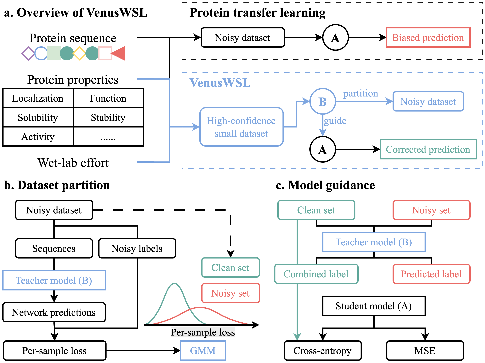

# Robust Adaptation of Pre-trained Models to Inaccurate Biological Labels via Weak Supervision

## 🚀 Introduction (VenusWSL)
We present VenusWSL, a weakly supervised learning framework that addresses label noise in protein property prediction by leveraging a Gaussian Mixture Model to separate clean and noisy labels, enabling more robust training through a teacher-student approach.



## 📑 Results
### News

### Paper Results

## 🛫 Requirement
### Conda Environment
Please make sure you have installed [Anaconda3](https://www.anaconda.com/download/) or [Miniconda3](https://docs.conda.io/en/latest/miniconda.html).

```bash
conda env create -f environment.yml
conda activate venuswsl
```

### Hardware
We recommend using a GPU with at least 12GB memory.

## 🧬 Start with VenusWSL
